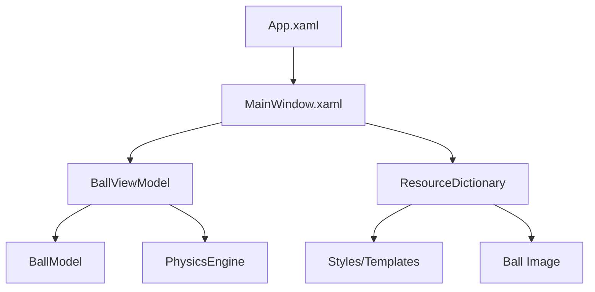

# Design Document: Ball Drag and Drop Application

## Overview

This document outlines the design for a desktop application that allows users to drag, drop, and throw a bitmap of a ball around the application window. The application will be built using .NET 9 with Windows Presentation Foundation (WPF) to create a responsive and visually appealing user experience.

The application will feature a clean interface with a ball graphic that users can interact with using mouse input. The core functionality includes dragging and dropping the ball, as well as throwing it with momentum-based physics for more dynamic interactions.

## Architecture

The application will follow the Model-View-ViewModel (MVVM) architectural pattern, which is well-suited for WPF applications. This pattern will help separate the UI logic from the business logic and data, making the code more maintainable and testable.

### Key Components



1. **App.xaml**: The entry point of the application.
2. **MainWindow.xaml**: The main window of the application containing the UI elements.
3. **BallViewModel**: Handles the presentation logic and user interactions.
4. **BallModel**: Represents the data and state of the ball.
5. **PhysicsEngine**: Manages the physics calculations for ball movement and momentum.
6. **ResourceDictionary**: Contains styles, templates, and resources used in the application.

## Components and Interfaces

### MainWindow

The MainWindow will serve as the container for the application's UI elements. It will:
- Host the Canvas where the ball will be displayed and moved
- Handle window-related events (resize, close)
- Maintain the application's visual appearance

```xml
<Window x:Class="BallDragDrop.MainWindow"
        xmlns="http://schemas.microsoft.com/winfx/2006/xaml/presentation"
        xmlns:x="http://schemas.microsoft.com/winfx/2006/xaml"
        Title="Ball Drag and Drop" Height="450" Width="800">
    <Canvas x:Name="MainCanvas">
        <!-- Ball will be added here -->
    </Canvas>
</Window>
```

### BallViewModel

The BallViewModel will act as an intermediary between the View (MainWindow) and the Model (BallModel). It will:
- Expose properties for the ball's position, size, and state
- Handle user input events (mouse down, move, up)
- Implement commands for user interactions
- Manage the physics calculations through the PhysicsEngine

```csharp
public class BallViewModel : INotifyPropertyChanged
{
    private BallModel _ball;
    private PhysicsEngine _physicsEngine;
    
    // Properties for binding
    public double X { get; set; }
    public double Y { get; set; }
    public bool IsDragging { get; set; }
    public ImageSource BallImage { get; set; }
    
    // Commands
    public ICommand MouseDownCommand { get; }
    public ICommand MouseMoveCommand { get; }
    public ICommand MouseUpCommand { get; }
    
    // Methods for handling drag, drop, and throw
    // Implementation of INotifyPropertyChanged
}
```

### BallModel

The BallModel will represent the data and state of the ball. It will:
- Store the ball's position, velocity, and other physical properties
- Provide methods to update the ball's state

```csharp
public class BallModel
{
    public double X { get; set; }
    public double Y { get; set; }
    public double VelocityX { get; set; }
    public double VelocityY { get; set; }
    public double Radius { get; set; }
    public double Mass { get; set; }
    
    // Methods to update position, apply forces, etc.
}
```

### PhysicsEngine

The PhysicsEngine will handle the physics calculations for the ball's movement. It will:
- Calculate the ball's trajectory when thrown
- Apply friction to slow down the ball over time
- Handle collision detection with window boundaries
- Implement bouncing behavior

```csharp
public class PhysicsEngine
{
    // Constants for physics calculations
    private const double Friction = 0.98;
    private const double Gravity = 0.5;
    private const double BounceRestitution = 0.8;
    
    // Methods for physics calculations
    public void ApplyVelocity(BallModel ball)
    public void ApplyFriction(BallModel ball)
    public void HandleBoundaryCollision(BallModel ball, double windowWidth, double windowHeight)
    public void CalculateThrowVelocity(BallModel ball, Point startPoint, Point endPoint, double timeInterval)
}
```

## Data Models

### Ball Properties

The ball will have the following properties:

- **Position (X, Y)**: The current coordinates of the ball on the canvas
- **Velocity (VelocityX, VelocityY)**: The speed and direction of the ball's movement
- **Radius**: The size of the ball (for collision detection)
- **Mass**: Used in physics calculations
- **IsDragging**: Boolean flag indicating whether the ball is being dragged

### Mouse Interaction Data

To handle mouse interactions, we'll track:

- **MouseStartPosition**: The position where the user first clicked the ball
- **BallStartPosition**: The ball's position when the user started dragging
- **LastMousePosition**: The previous mouse position (for calculating velocity)
- **MouseVelocity**: The speed and direction of the mouse movement
- **LastUpdateTime**: Timestamp for calculating time intervals

## User Interface Design

The user interface will be minimalistic, focusing on the ball interaction:

1. **Main Window**: A clean window with a title and a canvas area
2. **Ball Representation**: A bitmap image of a ball displayed on the canvas
3. **Cursor Feedback**: Cursor changes to indicate when the ball can be grabbed and when it's being moved

### Cursor States

- **Default**: Standard cursor when not interacting with the ball
- **Hand**: When hovering over the ball to indicate it can be grabbed
- **Closed Hand/Grabbing**: When dragging the ball

## Error Handling

The application will implement the following error handling strategies:

1. **Image Loading Errors**: If the ball image cannot be loaded, a fallback shape (e.g., a colored circle) will be displayed instead.
2. **Out-of-Bounds Handling**: Logic to prevent the ball from leaving the visible area of the window.
3. **Exception Handling**: Try-catch blocks around critical operations with appropriate user feedback.
4. **Logging**: Basic logging of errors for troubleshooting.

## Animation and Physics

### Ball Movement

The ball's movement will be handled through two mechanisms:

1. **Direct Manipulation**: When dragging, the ball follows the mouse position directly.
2. **Physics-Based Animation**: When thrown, the ball moves according to physics calculations.

### Physics Calculations

The physics system will implement:

1. **Momentum**: Calculate velocity based on the speed and direction of mouse movement before release.
2. **Friction**: Gradually reduce velocity over time to simulate friction.
3. **Collision**: Detect and respond to collisions with window boundaries.
4. **Bouncing**: Implement realistic bouncing behavior when the ball hits the edges.

## Performance Considerations

To ensure smooth performance:

1. **Rendering Optimization**: Use hardware acceleration for rendering.
2. **Animation Frame Rate**: Target 60 FPS for smooth animations.
3. **Event Throttling**: Limit the frequency of mouse move event handling if necessary.
4. **Efficient Collision Detection**: Implement simple but efficient collision detection algorithms.

## Testing Strategy

The testing strategy will include:

1. **Unit Testing**:
   - Test physics calculations
   - Test boundary collision detection
   - Test velocity and position updates

2. **Integration Testing**:
   - Test the interaction between the ViewModel and the Model
   - Test the physics engine integration

3. **UI Testing**:
   - Test mouse interaction with the ball
   - Test window resizing behavior
   - Test animation smoothness

4. **Performance Testing**:
   - Measure frame rates during animations
   - Test responsiveness of drag operations