# Design Document

## Overview

The ball state machine feature introduces a structured approach to managing ball states using the Stateless library for .NET. This design integrates seamlessly with the existing BallDragDrop application architecture, providing clear state transitions and behavior control for the ball's lifecycle. The state machine will manage three primary states: Idle, Held, and Thrown, with well-defined triggers and actions for each transition.

The implementation leverages the existing BallViewModel, PhysicsEngine, and BallModel components while introducing a new BallStateMachine service that coordinates state-dependent behavior across the application.

## Architecture

### State Machine Design

The state machine follows a hierarchical design with three primary states:

```mermaid
stateDiagram-v2
    [*] --> Idle : Application Start
    
    Idle --> Held : MouseDown
    Held --> Thrown : Release
    Thrown --> Idle : VelocityBelowThreshold
    
    Idle --> Idle : Reset
    Held --> Idle : Reset
    Thrown --> Idle : Reset
    
    state Idle {
        [*] --> WaitingForInput
        WaitingForInput : Ball at rest
        WaitingForInput : Physics disabled
        WaitingForInput : Default visual state
    }
    
    state Held {
        [*] --> BeingDragged
        BeingDragged : Following mouse cursor
        BeingDragged : Physics calculations paused
        BeingDragged : Visual feedback active
    }
    
    state Thrown {
        [*] --> InMotion
        InMotion : Physics calculations active
        InMotion : Velocity tracking enabled
        InMotion : Motion visual feedback
        InMotion --> CheckingVelocity : Continuous monitoring
        CheckingVelocity --> InMotion : Velocity > threshold
        CheckingVelocity --> [*] : Velocity ≤ threshold
    }
```



### Component Integration

The state machine integrates with existing components through a service-oriented approach:

- **BallStateMachine**: Core state machine service using Stateless library
- **IBallStateObserver**: Interface for components that need to react to state changes
- **BallViewModel**: Updated to use state machine for drag/drop logic
- **PhysicsEngine**: Modified to respect state-dependent physics calculations
- **StateVisualizer**: New component for visual state feedback

## Components and Interfaces

### BallStateMachine Service

```csharp
public class BallStateMachine : IBallStateMachine
{
    private readonly StateMachine<BallState, BallTrigger> _stateMachine;
    private readonly ILogService _logService;
    private readonly List<IBallStateObserver> _observers;
    
    public BallState CurrentState { get; }
    public event EventHandler<BallStateChangedEventArgs> StateChanged;
    
    public void Fire(BallTrigger trigger);
    public bool CanFire(BallTrigger trigger);
    public void Subscribe(IBallStateObserver observer);
    public void Unsubscribe(IBallStateObserver observer);
}
```

### State and Trigger Enumerations

```csharp
public enum BallState
{
    Idle,
    Held,
    Thrown
}

public enum BallTrigger
{
    MouseDown,
    Release,
    VelocityBelowThreshold,
    Reset
}
```

### State Observer Interface

```csharp
public interface IBallStateObserver
{
    void OnStateChanged(BallState previousState, BallState newState, BallTrigger trigger);
}
```

### Enhanced BallViewModel Integration

The BallViewModel will be updated to integrate with the state machine:

```csharp
public class BallViewModel : INotifyPropertyChanged, IBallStateObserver
{
    private readonly IBallStateMachine _stateMachine;
    
    // Existing properties plus:
    public BallState CurrentState => _stateMachine.CurrentState;
    public bool IsInIdleState => CurrentState == BallState.Idle;
    public bool IsInHeldState => CurrentState == BallState.Held;
    public bool IsInThrownState => CurrentState == BallState.Thrown;
    
    // State-aware mouse event handlers
    private void OnMouseDown(MouseEventArgs e);
    private void OnMouseUp(MouseEventArgs e);
    
    // IBallStateObserver implementation
    public void OnStateChanged(BallState previousState, BallState newState, BallTrigger trigger);
}
```

### Status Bar Integration

The current ball state will be displayed in the status bar's "Status" field (second field from the left). The StatusBarViewModel will be enhanced to observe ball state changes:

```csharp
public class StatusBarViewModel : INotifyPropertyChanged, IBallStateObserver
{
    private readonly IBallStateMachine _stateMachine;
    
    // Enhanced Status property to show ball state
    public string Status 
    { 
        get => _status; 
        private set 
        { 
            _status = value; 
            OnPropertyChanged(); 
        } 
    }
    private string _status;
    
    // IBallStateObserver implementation
    public void OnStateChanged(BallState previousState, BallState newState, BallTrigger trigger)
    {
        Status = FormatBallStateForDisplay(newState);
    }
    
    private string FormatBallStateForDisplay(BallState state)
    {
        return state switch
        {
            BallState.Idle => "Ball: Idle",
            BallState.Held => "Ball: Held",
            BallState.Thrown => "Ball: Thrown",
            _ => "Ball: Unknown"
        };
    }
}
```

### Physics Engine Integration

The PhysicsEngine will be enhanced to respect ball states:

```csharp
public class PhysicsEngine
{
    // Enhanced UpdateBall method with state awareness
    public (bool IsMoving, bool HitLeft, bool HitRight, bool HitTop, bool HitBottom) 
        UpdateBall(BallModel ball, double timeStep, double minX, double minY, 
                  double maxX, double maxY, BallState currentState);
    
    // State-specific physics behavior
    private bool ShouldApplyPhysics(BallState state);
    private bool ShouldCheckVelocityThreshold(BallState state);
}
```

## Data Models

### BallStateChangedEventArgs

```csharp
public class BallStateChangedEventArgs : EventArgs
{
    public BallState PreviousState { get; }
    public BallState NewState { get; }
    public BallTrigger Trigger { get; }
    public DateTime Timestamp { get; }
    
    public BallStateChangedEventArgs(BallState previousState, BallState newState, 
                                   BallTrigger trigger)
    {
        PreviousState = previousState;
        NewState = newState;
        Trigger = trigger;
        Timestamp = DateTime.Now;
    }
}
```

### State Configuration Data

```csharp
public class BallStateConfiguration
{
    public double VelocityThreshold { get; set; } = 50.0;
    public TimeSpan StateTransitionDelay { get; set; } = TimeSpan.FromMilliseconds(100);
    public bool EnableStateLogging { get; set; } = true;
    public bool EnableVisualFeedback { get; set; } = true;
}
```

## Error Handling

### State Transition Validation

The state machine implements comprehensive validation for state transitions:

1. **Invalid Transition Prevention**: Attempts to fire invalid triggers are logged and ignored
2. **State Consistency Checks**: Regular validation ensures the state machine remains in a valid state
3. **Recovery Mechanisms**: Automatic recovery to Idle state if inconsistencies are detected
4. **Exception Handling**: All state machine operations are wrapped in try-catch blocks with appropriate logging

### Error Recovery Strategies

```csharp
public class BallStateMachine
{
    private void HandleStateTransitionError(Exception ex, BallTrigger trigger)
    {
        _logService.LogError(ex, "State transition error for trigger {Trigger}", trigger);
        
        // Attempt recovery to safe state
        if (_stateMachine.CanFire(BallTrigger.VelocityBelowThreshold))
        {
            _stateMachine.Fire(BallTrigger.VelocityBelowThreshold);
        }
    }
    
    private void ValidateStateConsistency()
    {
        // Periodic validation of state machine consistency
        // Reset to Idle if inconsistencies detected
    }
}
```

## Testing Strategy

### Unit Testing Approach

1. **State Machine Logic Tests**
   - Valid state transitions
   - Invalid transition rejection
   - Trigger validation
   - Observer notification

2. **Integration Tests**
   - BallViewModel state integration
   - PhysicsEngine state-aware behavior
   - Visual feedback coordination

3. **State Transition Tests**
   - Complete state lifecycle testing
   - Edge case handling
   - Concurrent access scenarios

### Test Structure

```csharp
[TestClass]
public class BallStateMachineTests
{
    [TestMethod]
    public void Should_StartInIdleState();
    
    [TestMethod]
    public void Should_TransitionToHeldOnMouseDown();
    
    [TestMethod]
    public void Should_TransitionToThrownOnRelease();
    
    [TestMethod]
    public void Should_ReturnToIdleWhenVelocityBelowThreshold();
    
    [TestMethod]
    public void Should_RejectInvalidTransitions();
    
    [TestMethod]
    public void Should_NotifyObserversOnStateChange();
}
```

### Mock Objects and Test Doubles

- **MockLogService**: For testing logging behavior
- **MockBallStateObserver**: For testing observer notifications
- **TestBallModel**: Simplified ball model for testing
- **MockPhysicsEngine**: For testing physics integration

## Performance Considerations

### State Machine Optimization

1. **Minimal Allocations**: State machine operations avoid unnecessary object creation
2. **Efficient Observer Pattern**: Observer list management optimized for frequent notifications
3. **Lazy Initialization**: State machine components initialized only when needed
4. **Thread Safety**: State machine operations are thread-safe for UI thread access

### Integration Performance

1. **State Caching**: Current state cached to avoid repeated state machine queries
2. **Conditional Physics**: Physics calculations skipped when ball is in Held state
3. **Batched Notifications**: State change notifications batched when multiple rapid transitions occur
4. **Memory Management**: Proper disposal of state machine resources and observers

### Reset Functionality Integration

The reset functionality requires proper coordination between MainWindow and BallViewModel to ensure state machine transitions:

```csharp
// In MainWindow.xaml.cs - Reset_Click event handler
private void Reset_Click(object sender, RoutedEventArgs e)
{
    // Stop physics simulation
    _isPhysicsRunning = false;
    
    // Release mouse capture if dragging
    if (ballViewModel.IsDragging)
    {
        Mouse.Capture(null);
    }
    
    // Calculate center position and use BallViewModel.ResetBall()
    // This ensures proper state machine reset
    double centerX = MainCanvas.Width / 2;
    double centerY = MainCanvas.Height / 2;
    ballViewModel.ResetBall(centerX, centerY);
    
    // Clear mouse tracking history
    _mouseHistoryCount = 0;
}

// In BallViewModel.cs - ResetBall method
public void ResetBall(double centerX, double centerY)
{
    // Stop animation and clear drag state
    // Reset ball position and velocity
    // Trigger state machine Reset transition to Idle
    if (_stateMachine != null && _stateMachine.CanFire(BallTrigger.Reset))
    {
        _stateMachine.Fire(BallTrigger.Reset);
    }
    // Restart animation if needed
}
```

## Configuration and Extensibility

### Dependency Injection Integration

The state machine integrates with the existing DI container:

```csharp
// In Program.cs or DI configuration
services.AddSingleton<IBallStateMachine, BallStateMachine>();
services.AddSingleton<BallStateConfiguration>();
services.Configure<BallStateConfiguration>(config =>
{
    config.VelocityThreshold = 50.0;
    config.EnableStateLogging = true;
});
```

### Extension Points

1. **Custom States**: Framework allows addition of new states (e.g., Bouncing, Spinning)
2. **Custom Triggers**: New triggers can be added for extended functionality
3. **Observer Extensions**: Additional observers can be registered for custom behavior
4. **State Actions**: Custom actions can be configured for state entry/exit

### Configuration Options

The state machine behavior can be configured through:
- Application configuration files
- Runtime configuration updates
- Environment-specific settings
- User preferences integration