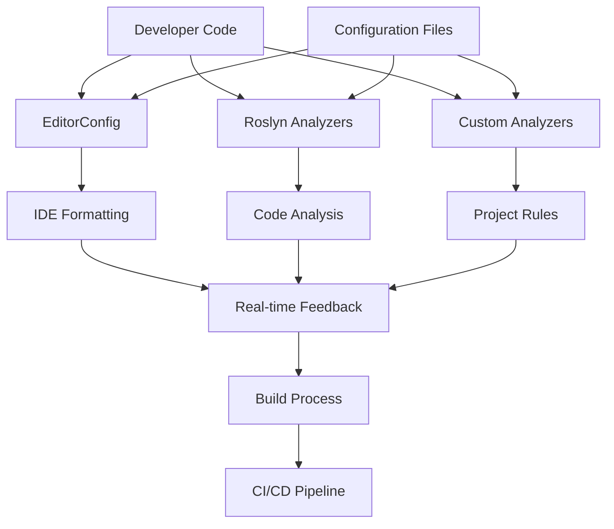

# Design Document: Coding Standards Adherence

## Overview

This design implements automated coding standards enforcement for the BallDragDrop C# WPF project using a multi-layered approach combining EditorConfig, Roslyn analyzers, custom analyzers, and MSBuild integration. The solution will enforce project-specific standards including folder structure, method regions, XML documentation, and general C# best practices.

## Architecture

The coding standards enforcement system consists of four main components:

1. **Configuration Layer**: EditorConfig and custom rule configuration files
2. **Analysis Layer**: Roslyn analyzers and custom analyzers for project-specific rules
3. **Integration Layer**: MSBuild targets and IDE integration
4. **Reporting Layer**: Build output and IDE feedback mechanisms



## Components and Interfaces

### 1. Configuration Management

**EditorConfig (.editorconfig)**
- Root configuration file for basic formatting rules
- Defines indentation, line endings, charset, and basic C# formatting
- Automatically recognized by Visual Studio and VS Code

**Custom Rules Configuration (coding-standards.json)**
- Project-specific rules for folder structure validation
- Method region requirements
- XML documentation standards
- Custom naming conventions beyond standard C# rules

### 2. Analysis Components

**Standard Roslyn Analyzers**
- Microsoft.CodeAnalysis.Analyzers: Core analysis functionality
- Microsoft.CodeAnalysis.NetAnalyzers: .NET specific rules
- StyleCop.Analyzers: Extended C# style rules

**Custom Analyzer Assembly (BallDragDrop.CodeAnalysis)**
- FolderStructureAnalyzer: Validates Contracts and Bootstrapper folder placement
- MethodRegionAnalyzer: Enforces #region/#endregion around methods
- XmlDocumentationAnalyzer: Validates comprehensive XML documentation
- ProjectStructureAnalyzer: Validates overall project organization
- ThisQualifierAnalyzer: Enforces mandatory use of "this." qualifier for instance members
- ClassFileOrganizationAnalyzer: Enforces one class per file with matching filename, with special handling for WPF XAML code-behind files

### 3. Integration Components

**MSBuild Integration**
- Custom MSBuild targets for pre-build validation
- Integration with existing GitLab CI/CD pipeline
- Code quality report generation

**IDE Integration**
- Real-time feedback through diagnostic messages
- Quick fixes and code actions for common violations
- Integration with existing development workflow

## Data Models

### Rule Configuration Model

```csharp
public class CodingStandardsConfig
{
    public FolderStructureRules FolderStructure { get; set; }
    public MethodRegionRules MethodRegions { get; set; }
    public XmlDocumentationRules Documentation { get; set; }
    public NamingConventionRules Naming { get; set; }
    public ThisQualifierRules ThisQualifier { get; set; }
}

public class FolderStructureRules
{
    public string[] RequiredFolders { get; set; }
    public Dictionary<string, string[]> FileTypeToFolderMapping { get; set; }
}

public class MethodRegionRules
{
    public bool EnforceRegions { get; set; }
    public string RegionNameFormat { get; set; }
    public string[] ExemptMethodTypes { get; set; }
}

public class ThisQualifierRules
{
    public bool EnforceThisQualifier { get; set; } = true;
    public bool ApplyToProperties { get; set; } = true;
    public bool ApplyToMethods { get; set; } = true;
    public bool ApplyToFields { get; set; } = true;
    public DiagnosticSeverity ViolationSeverity { get; set; } = DiagnosticSeverity.Error;
    public string[] ExemptMemberTypes { get; set; }
}

public class ClassFileOrganizationRules
{
    public bool EnforceOneClassPerFile { get; set; } = true;
    public bool EnforceFilenameMatchesClassName { get; set; } = true;
    public bool AllowNestedClasses { get; set; } = true;
    public bool AllowPartialClasses { get; set; } = true;
    public bool AllowWpfXamlCodeBehind { get; set; } = true;
    public DiagnosticSeverity ViolationSeverity { get; set; } = DiagnosticSeverity.Error;
    public string[] WpfCodeBehindExtensions { get; set; } = { ".xaml.cs", ".xaml.vb" };
}
```

### Diagnostic Models

```csharp
public class CodingStandardDiagnostic
{
    public string Id { get; set; }
    public DiagnosticSeverity Severity { get; set; }
    public string Title { get; set; }
    public string MessageFormat { get; set; }
    public string Category { get; set; }
}
```

## Error Handling

### Analyzer Error Handling
- Graceful degradation when configuration files are missing or malformed
- Detailed error messages for configuration issues
- Fallback to default rules when custom rules fail to load

### Build Integration Error Handling
- Non-blocking warnings for style violations
- Blocking errors for critical structural violations
- Clear error messages with suggested fixes

### IDE Integration Error Handling
- Robust handling of analyzer exceptions to prevent IDE crashes
- Timeout protection for long-running analysis operations
- Fallback mechanisms when analyzers fail to load

## Testing Strategy

### Unit Testing
- **Analyzer Unit Tests**: Test each custom analyzer with various code scenarios
- **Configuration Tests**: Validate rule loading and parsing
- **Integration Tests**: Test MSBuild target execution

### Integration Testing
- **Build Pipeline Tests**: Validate CI/CD integration
- **IDE Integration Tests**: Test real-time feedback in development environment
- **End-to-End Tests**: Complete workflow from code writing to build completion

### Test Data Strategy
- Sample code files representing various violation scenarios
- Configuration files with different rule combinations
- Mock project structures for folder validation testing

## Implementation Phases

### Phase 1: Basic Configuration and Standard Rules
- Implement EditorConfig with basic formatting rules
- Add standard Roslyn analyzers to project
- Configure MSBuild integration for existing analyzers

### Phase 2: Custom Analyzers Development
- Develop FolderStructureAnalyzer for Contracts/Bootstrapper validation
- Implement MethodRegionAnalyzer for region enforcement
- Create XmlDocumentationAnalyzer for comprehensive documentation
- Implement ThisQualifierAnalyzer for mandatory "this." qualifier usage with error-level enforcement
- Implement ClassFileOrganizationAnalyzer for one class per file enforcement

### Phase 3: Advanced Integration
- Implement custom MSBuild targets for pre-build validation
- Add code fix providers for automatic violation resolution
- Integrate with GitLab CI/CD pipeline

### Phase 4: Reporting and Monitoring
- Implement code quality reporting
- Add metrics collection for standards compliance
- Create dashboard for tracking compliance over time

## Configuration Files Structure

```
src/
├── .editorconfig (root level)
├── coding-standards.json
├── BallDragDrop/
│   ├── Contracts/ (new folder for interfaces/abstracts)
│   ├── Bootstrapper/ (new folder, move ServiceBootstrapper here)
│   ├── Models/
│   ├── Services/
│   ├── ViewModels/
│   └── Views/
└── BallDragDrop.CodeAnalysis/ (new analyzer project)
```

## WPF-Specific Considerations

### XAML Code-Behind File Handling
The system must account for WPF's standard pattern where XAML files have corresponding code-behind files:

- **File Naming Pattern**: `MainWindow.xaml` → `MainWindow.xaml.cs` containing class `MainWindow`
- **Exception Logic**: Files ending with `.xaml.cs` are exempt from strict filename-to-classname matching
- **Validation Rules**: 
  - `SplashScreen.xaml.cs` containing class `SplashScreen` is valid
  - `MainWindow.xaml.cs` containing class `MainWindow` is valid
  - Multiple classes in `.xaml.cs` files are still prohibited
- **Detection Method**: Analyzer checks for corresponding `.xaml` file existence to confirm code-behind status

### WPF Project Structure
- Views folder contains both `.xaml` and `.xaml.cs` files
- Code-behind files follow partial class pattern generated by WPF designer
- Designer-generated code is typically in separate `.g.cs` files (auto-generated, should be excluded from analysis)

## Performance Considerations

- Analyzers designed to run incrementally during development
- Caching of analysis results to avoid redundant processing
- Configurable analysis scope to balance thoroughness with performance
- Parallel execution of independent analysis rules

## Security Considerations

- Configuration files validated to prevent injection attacks
- Analyzer assemblies signed and verified
- Restricted file system access for analyzers
- Secure handling of diagnostic information in CI/CD pipeline