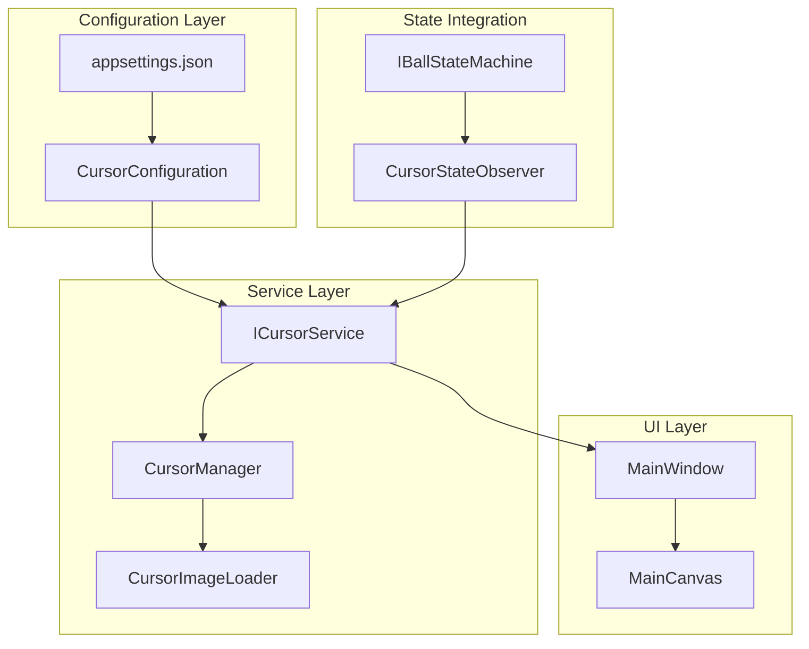

# Design Document

## Overview

The configurable PNG cursor feature introduces a dynamic cursor management system that allows the Ball Drag and Drop application to use custom PNG images as mouse cursors that change based on hand/interaction state. The system implements its own hand state machine that operates independently from the ball state machine while responding to both ball state changes and mouse interaction events to provide contextual visual feedback through cursor changes.

The implementation leverages WPF's cursor system, the existing configuration infrastructure, and introduces a new hand state machine to create a seamless, performant cursor management solution that maintains the application's architectural patterns and coding standards.

## Architecture

### Cursor Management System Design

The cursor system follows a service-oriented architecture that integrates with existing components:



### Hand State Machine Design

The cursor system uses an independent hand state machine that responds to both ball state changes and mouse events:

```mermaid
stateDiagram-v2
    [*] --> Default : Application Start
    
    Default --> Hover : Mouse Over Ball (Ball: Idle)
    Hover --> Default : Mouse Leave Ball
    Hover --> Grabbing : Mouse Down (Ball: Idle → Held)
    
    Default --> Grabbing : Mouse Down (Direct)
    Grabbing --> Releasing : Mouse Up (Ball: Held → Thrown)
    Releasing --> Default : Release Complete
    
    state Default {
        [*] --> LoadingDefault
        LoadingDefault : Load default.png (30x30)
        LoadingDefault --> Ready
        Ready : Normal cursor state
    }
    
    state Hover {
        [*] --> LoadingHover
        LoadingHover : Load hover.png (30x30)
        LoadingHover --> Ready
        Ready : Mouse over interactable
    }
    
    state Grabbing {
        [*] --> LoadingGrab
        LoadingGrab : Load grabbing.png (30x30)
        LoadingGrab --> Ready
        Ready : Actively dragging
    }
    
    state Releasing {
        [*] --> LoadingRelease
        LoadingRelease : Load releasing.png (30x30)
        LoadingRelease --> Ready
        Ready : Brief release state
    }
```

## Components and Interfaces

### IHandStateMachine Interface

```csharp
/// <summary>
/// State machine for managing hand/interaction states that drive cursor changes
/// </summary>
public interface IHandStateMachine
{
    /// <summary>
    /// Current hand state
    /// </summary>
    HandState CurrentState { get; }
    
    /// <summary>
    /// Event fired when hand state changes
    /// </summary>
    event EventHandler<HandStateChangedEventArgs> StateChanged;
    
    /// <summary>
    /// Triggers a hand state transition
    /// </summary>
    /// <param name="trigger">The trigger causing the transition</param>
    void Fire(HandTrigger trigger);
    
    /// <summary>
    /// Checks if a trigger can be fired from current state
    /// </summary>
    /// <param name="trigger">The trigger to check</param>
    /// <returns>True if trigger is valid</returns>
    bool CanFire(HandTrigger trigger);
    
    /// <summary>
    /// Resets hand state machine to default state
    /// </summary>
    void Reset();
}

/// <summary>
/// Hand states for cursor management
/// </summary>
public enum HandState
{
    Default,    // Normal cursor, ready for interaction
    Hover,      // Mouse over interactable element
    Grabbing,   // Actively dragging/holding
    Releasing   // Brief state during release
}

/// <summary>
/// Triggers for hand state transitions
/// </summary>
public enum HandTrigger
{
    MouseOverBall,      // Mouse enters ball area
    MouseLeaveBall,     // Mouse leaves ball area
    StartGrabbing,      // Begin drag operation
    StopGrabbing,       // End drag operation
    ReleaseComplete,    // Release animation complete
    Reset              // Reset to default state
}
```

### ICursorService Interface

```csharp
/// <summary>
/// Service for managing custom PNG cursors based on hand state
/// </summary>
public interface ICursorService
{
    /// <summary>
    /// Sets the cursor for the specified hand state
    /// </summary>
    /// <param name="handState">The hand state</param>
    void SetCursorForHandState(HandState handState);
    
    /// <summary>
    /// Reloads cursor configuration from settings
    /// </summary>
    Task ReloadConfigurationAsync();
    
    /// <summary>
    /// Gets the current cursor state for debugging
    /// </summary>
    string GetCurrentCursorState();
}
```

### HandStateMachine Implementation

```csharp
/// <summary>
/// State machine for managing hand/interaction states
/// </summary>
public class HandStateMachine : IHandStateMachine, IBallStateObserver
{
    private readonly StateMachine<HandState, HandTrigger> _stateMachine;
    private readonly ILogService _logService;
    private readonly ICursorService _cursorService;
    
    public HandState CurrentState => _stateMachine.State;
    public event EventHandler<HandStateChangedEventArgs> StateChanged;
    
    public void Fire(HandTrigger trigger);
    public bool CanFire(HandTrigger trigger);
    public void Reset();
    
    // IBallStateObserver implementation
    public void OnStateChanged(BallState previousState, BallState newState, BallTrigger trigger);
    
    private void OnHandStateChanged(HandState newState);
    private void ConfigureStateMachine();
}

/// <summary>
/// Manages cursor loading, caching, and application
/// </summary>
public class CursorManager : ICursorService
{
    private readonly IConfigurationService _configurationService;
    private readonly ILogService _logService;
    private readonly CursorImageLoader _imageLoader;
    private readonly Dictionary<HandState, Cursor> _cursorCache;
    private readonly object _cacheLock = new object();
    
    public void SetCursorForHandState(HandState handState);
    public Task ReloadConfigurationAsync();
    public string GetCurrentCursorState();
    
    private Cursor LoadCursorFromPng(string pngPath);
    private Cursor CreateFallbackCursor();
    private void CacheCursor(HandState handState, Cursor cursor);
}
```

### CursorImageLoader

```csharp
/// <summary>
/// Handles PNG image loading and conversion to WPF cursors
/// </summary>
public class CursorImageLoader
{
    private const int CURSOR_SIZE = 30;
    private readonly ILogService _logService;
    
    /// <summary>
    /// Loads a PNG file and converts it to a WPF Cursor
    /// </summary>
    /// <param name="pngPath">Relative path to the PNG file from application directory</param>
    /// <returns>WPF Cursor object</returns>
    public Cursor LoadPngAsCursor(string pngPath);
    
    /// <summary>
    /// Resizes an image to the standard cursor size (30x30)
    /// </summary>
    /// <param name="source">Source bitmap image</param>
    /// <returns>Resized bitmap image</returns>
    private BitmapImage ResizeImage(BitmapImage source);
    
    /// <summary>
    /// Converts a BitmapImage to a Cursor
    /// </summary>
    /// <param name="bitmap">Source bitmap</param>
    /// <returns>WPF Cursor</returns>
    private Cursor ConvertBitmapToCursor(BitmapImage bitmap);
}
```

### HandStateChangedEventArgs

```csharp
/// <summary>
/// Event arguments for hand state changes
/// </summary>
public class HandStateChangedEventArgs : EventArgs
{
    /// <summary>
    /// Previous hand state
    /// </summary>
    public HandState PreviousState { get; }
    
    /// <summary>
    /// New hand state
    /// </summary>
    public HandState NewState { get; }
    
    /// <summary>
    /// Trigger that caused the state change
    /// </summary>
    public HandTrigger Trigger { get; }
    
    /// <summary>
    /// Timestamp of the state change
    /// </summary>
    public DateTime Timestamp { get; }
    
    public HandStateChangedEventArgs(HandState previousState, HandState newState, HandTrigger trigger)
    {
        PreviousState = previousState;
        NewState = newState;
        Trigger = trigger;
        Timestamp = DateTime.Now;
    }
}
```

### CursorConfiguration Model

```csharp
/// <summary>
/// Configuration model for cursor settings
/// </summary>
public class CursorConfiguration
{
    /// <summary>
    /// Path to default cursor PNG file
    /// </summary>
    public string DefaultCursorPath { get; set; } = "";
    
    /// <summary>
    /// Path to hover cursor PNG file
    /// </summary>
    public string HoverCursorPath { get; set; } = "";
    
    /// <summary>
    /// Path to grabbing cursor PNG file
    /// </summary>
    public string GrabbingCursorPath { get; set; } = "";
    
    /// <summary>
    /// Path to releasing cursor PNG file
    /// </summary>
    public string ReleasingCursorPath { get; set; } = "";
    
    /// <summary>
    /// Whether to enable custom cursors
    /// </summary>
    public bool EnableCustomCursors { get; set; } = true;
    
    /// <summary>
    /// Cursor update debounce time in milliseconds
    /// </summary>
    public int DebounceTimeMs { get; set; } = 16;
    
    /// <summary>
    /// Duration to show releasing cursor in milliseconds
    /// </summary>
    public int ReleasingDurationMs { get; set; } = 200;
}
```

## Data Models

### Enhanced appsettings.json Structure

The configuration will be added to the existing appsettings.json:

```json
{
  "defaultBallImagePath": "../../Resources/Ball/Ball01.png",
  "enableAnimations": true,
  "defaultBallSize": 50,
  "showBoundingBox": false,
  "cursorConfiguration": {
    "enableCustomCursors": true,
    "defaultCursorPath": "Resources/Cursors/default.png",
    "hoverCursorPath": "Resources/Cursors/hover.png",
    "grabbingCursorPath": "Resources/Cursors/grabbing.png",
    "releasingCursorPath": "Resources/Cursors/releasing.png",
    "debounceTimeMs": 16,
    "releasingDurationMs": 200
  }
}
```

### CursorStateChangedEventArgs

```csharp
/// <summary>
/// Event arguments for cursor state changes
/// </summary>
public class CursorStateChangedEventArgs : EventArgs
{
    /// <summary>
    /// Previous cursor state
    /// </summary>
    public string PreviousCursorState { get; }
    
    /// <summary>
    /// New cursor state
    /// </summary>
    public string NewCursorState { get; }
    
    /// <summary>
    /// Ball state that triggered the cursor change
    /// </summary>
    public BallState BallState { get; }
    
    /// <summary>
    /// Timestamp of the cursor change
    /// </summary>
    public DateTime Timestamp { get; }
    
    public CursorStateChangedEventArgs(string previousState, string newState, BallState ballState)
    {
        PreviousCursorState = previousState;
        NewCursorState = newState;
        BallState = ballState;
        Timestamp = DateTime.Now;
    }
}
```

## Error Handling

### Graceful Fallback Strategy

The cursor system implements comprehensive error handling with graceful fallbacks:

1. **PNG Loading Failures**: If a PNG file cannot be loaded, the system falls back to the default system cursor
2. **Configuration Errors**: Invalid configuration values are logged and default values are used
3. **Memory Allocation Failures**: If cursor creation fails, the system continues with system cursors
4. **File Not Found**: Missing PNG files trigger warnings and fallback to system cursors

### Error Recovery Implementation

```csharp
public class CursorManager
{
    private Cursor LoadCursorWithFallback(string pngPath, Cursor fallbackCursor)
    {
        try
        {
            if (string.IsNullOrEmpty(pngPath))
            {
                _logService.LogWarning("Cursor PNG path is empty");
                return fallbackCursor;
            }
            
            // Resolve path relative to application directory
            var fullPath = Path.Combine(AppDomain.CurrentDomain.BaseDirectory, pngPath);
            
            if (!File.Exists(fullPath))
            {
                _logService.LogWarning("Cursor PNG file not found: {FullPath}", fullPath);
                return fallbackCursor;
            }
            
            return _imageLoader.LoadPngAsCursor(fullPath);
        }
        catch (Exception ex)
        {
            _logService.LogError(ex, "Failed to load cursor from PNG: {PngPath}", pngPath);
            return fallbackCursor;
        }
    }
    
    private void HandleCursorApplicationError(Exception ex, BallState state)
    {
        _logService.LogError(ex, "Failed to apply cursor for state {State}", state);
        
        // Attempt to apply default system cursor
        try
        {
            Application.Current.MainWindow.Cursor = Cursors.Arrow;
        }
        catch (Exception fallbackEx)
        {
            _logService.LogError(fallbackEx, "Failed to apply fallback cursor");
        }
    }
}
```

## Testing Strategy

### Unit Testing Approach

1. **Cursor Loading Tests**
   - Valid PNG file loading
   - Invalid file handling
   - Image resizing validation
   - Cursor conversion accuracy

2. **State Integration Tests**
   - State change cursor updates
   - Observer pattern functionality
   - Configuration reload behavior

3. **Performance Tests**
   - Cursor change timing (< 16ms requirement)
   - Memory usage validation
   - Cache efficiency testing

### Test Structure

```csharp
[TestClass]
public class CursorManagerTests
{
    [TestMethod]
    public void Should_LoadValidPngAsCursor();
    
    [TestMethod]
    public void Should_FallbackToSystemCursorWhenPngInvalid();
    
    [TestMethod]
    public void Should_ResizeImageTo30x30Pixels();
    
    [TestMethod]
    public void Should_UpdateCursorOnStateChange();
    
    [TestMethod]
    public void Should_CacheCursorsForPerformance();
    
    [TestMethod]
    public void Should_HandleConfigurationReload();
    
    [TestMethod]
    public void Should_DebounceRapidStateChanges();
}

[TestClass]
public class CursorImageLoaderTests
{
    [TestMethod]
    public void Should_LoadPngFileSuccessfully();
    
    [TestMethod]
    public void Should_ResizeToExact30x30Pixels();
    
    [TestMethod]
    public void Should_HandleCorruptedPngFiles();
    
    [TestMethod]
    public void Should_ConvertBitmapToCursorCorrectly();
}
```

### Integration Testing

```csharp
[TestClass]
public class CursorIntegrationTests
{
    [TestMethod]
    public void Should_IntegrateWithBallStateMachine();
    
    [TestMethod]
    public void Should_UpdateCursorOnMouseEvents();
    
    [TestMethod]
    public void Should_ReloadConfigurationDynamically();
    
    [TestMethod]
    public void Should_MaintainPerformanceUnder60Fps();
}
```

## Performance Considerations

### Cursor Caching Strategy

1. **Memory Caching**: All loaded cursors are cached in memory to avoid repeated file I/O
2. **Lazy Loading**: Cursors are loaded only when first needed
3. **Cache Invalidation**: Cache is cleared when configuration is reloaded
4. **Memory Management**: Proper disposal of cursor resources

### Performance Optimizations

```csharp
public class CursorManager
{
    private readonly Dictionary<BallState, Cursor> _cursorCache = new();
    private readonly EventThrottler _cursorUpdateThrottler;
    
    public CursorManager(IConfigurationService configurationService, ILogService logService)
    {
        _cursorUpdateThrottler = new EventThrottler(TimeSpan.FromMilliseconds(16));
    }
    
    public void SetCursorForState(BallState state)
    {
        _cursorUpdateThrottler.Execute(() => ApplyCursorForState(state));
    }
    
    private void ApplyCursorForState(BallState state)
    {
        lock (_cacheLock)
        {
            if (!_cursorCache.TryGetValue(state, out var cursor))
            {
                cursor = LoadCursorForState(state);
                _cursorCache[state] = cursor;
            }
            
            Application.Current.Dispatcher.BeginInvoke(() =>
            {
                Application.Current.MainWindow.Cursor = cursor;
            });
        }
    }
}
```

### Debouncing Implementation

To prevent cursor flickering during rapid state changes, the system implements debouncing:

```csharp
public class EventThrottler
{
    private readonly TimeSpan _throttleInterval;
    private DateTime _lastExecution = DateTime.MinValue;
    private readonly object _lock = new object();
    
    public void Execute(Action action)
    {
        lock (_lock)
        {
            var now = DateTime.Now;
            if (now - _lastExecution >= _throttleInterval)
            {
                action();
                _lastExecution = now;
            }
        }
    }
}
```

## Integration with Existing Architecture

### Dependency Injection Registration

The cursor services integrate with the existing DI container:

```csharp
// In ServiceBootstrapper.cs
public static class ServiceBootstrapper
{
    public static void ConfigureServices(IServiceCollection services)
    {
        // Existing services...
        
        // Cursor services
        services.AddSingleton<ICursorService, CursorManager>();
        services.AddSingleton<CursorImageLoader>();
        services.AddSingleton<CursorStateObserver>();
        
        // Configuration
        services.Configure<CursorConfiguration>(config =>
        {
            // Configuration binding from appsettings.json
        });
    }
}
```

### MainWindow Integration

The MainWindow will be enhanced to support cursor management:

```csharp
public partial class MainWindow : Window
{
    private readonly ICursorService _cursorService;
    
    public MainWindow(ICursorService cursorService)
    {
        _cursorService = cursorService;
        InitializeComponent();
        InitializeCursorHandling();
    }
    
    private void InitializeCursorHandling()
    {
        // Set up mouse enter/leave events for hover cursors
        MainCanvas.MouseEnter += OnCanvasMouseEnter;
        MainCanvas.MouseLeave += OnCanvasMouseLeave;
        
        // Ball-specific hover handling will be added to BallViewModel
    }
    
    private void OnCanvasMouseEnter(object sender, MouseEventArgs e)
    {
        // Determine if mouse is over ball and set appropriate cursor
        var isOverBall = IsMouseOverBall(e.GetPosition(MainCanvas));
        _cursorService.SetHoverCursor(isOverBall);
    }
}
```

### BallViewModel Enhancement

The BallViewModel will be enhanced to trigger cursor changes:

```csharp
public class BallViewModel : INotifyPropertyChanged, IBallStateObserver
{
    private readonly ICursorService _cursorService;
    
    public void OnStateChanged(BallState previousState, BallState newState, BallTrigger trigger)
    {
        // Existing state change handling...
        
        // Update cursor based on new state
        _cursorService.SetCursorForState(newState);
    }
    
    // Mouse event handlers will trigger hover cursor changes
    private void OnMouseEnter()
    {
        if (CurrentState == BallState.Idle)
        {
            _cursorService.SetHoverCursor(true);
        }
    }
    
    private void OnMouseLeave()
    {
        _cursorService.SetHoverCursor(false);
    }
}
```

## Resource Management

### PNG File Organization

Cursor PNG files will be organized in the Resources directory and copied to the output directory:

**Source Structure:**
```
src/BallDragDrop/Resources/
├── Ball/
│   └── Ball01.png
└── Cursors/
    ├── default.png    (30x30)
    ├── hover.png      (30x30)
    ├── grabbing.png   (30x30)
    └── releasing.png  (30x30)
```

**Output Structure (copied to bin/Debug/net9.0-windows/):**
```
Resources/
└── Cursors/
    ├── default.png
    ├── hover.png
    ├── grabbing.png
    └── releasing.png
```

**Project File Configuration:**
```xml
<ItemGroup>
  <Content Include="Resources\Cursors\*.png">
    <CopyToOutputDirectory>PreserveNewest</CopyToOutputDirectory>
  </Content>
</ItemGroup>
```

### Memory Management

```csharp
public class CursorManager : ICursorService, IDisposable
{
    public void Dispose()
    {
        lock (_cacheLock)
        {
            foreach (var cursor in _cursorCache.Values)
            {
                cursor?.Dispose();
            }
            _cursorCache.Clear();
            
            foreach (var cursor in _specialCursorCache.Values)
            {
                cursor?.Dispose();
            }
            _specialCursorCache.Clear();
        }
    }
}
```

This design provides a robust, performant, and maintainable cursor management system that integrates seamlessly with the existing Ball Drag and Drop application architecture while meeting all the specified requirements for configurable PNG cursors with state-based changes.