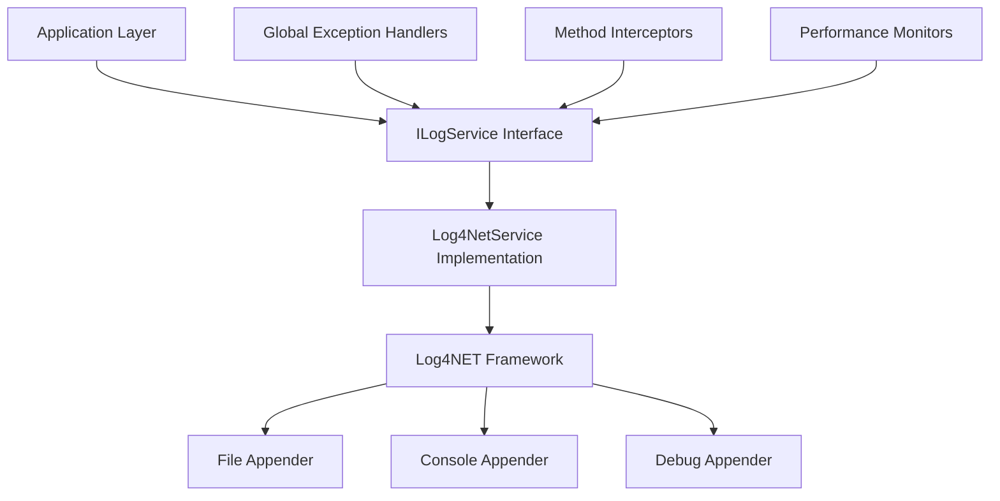

# Design Document - Logging and Error Handling

## Overview

This design document outlines the implementation of a comprehensive logging and error handling system for the Ball Drag and Drop WPF application. The system will replace the current basic logging implementation with a robust, configurable solution using Log4NET as the underlying framework, accessed through a clean ILogService interface.

The design focuses on providing structured logging with multiple output targets, automatic method entry/exit logging, and enhanced error handling that maintains application stability while providing detailed diagnostic information.

## Architecture

### High-Level Architecture



### Service Architecture

The logging system will be implemented using a service-oriented architecture with dependency injection:

1. **ILogService Interface**: Clean abstraction for logging operations
2. **Log4NetService**: Concrete implementation using Log4NET
3. **LoggingConfiguration**: Centralized configuration management
4. **ExceptionHandlingService**: Enhanced global exception handling
5. **MethodLoggingInterceptor**: Automatic method entry/exit logging

## Components and Interfaces

### ILogService Interface

```csharp
public interface ILogService
{
    // Standard logging methods
    void LogTrace(string message, params object[] args);
    void LogDebug(string message, params object[] args);
    void LogInformation(string message, params object[] args);
    void LogWarning(string message, params object[] args);
    void LogError(string message, params object[] args);
    void LogError(Exception exception, string message, params object[] args);
    void LogCritical(string message, params object[] args);
    void LogCritical(Exception exception, string message, params object[] args);
    
    // Structured logging methods
    void LogStructured(LogLevel level, string messageTemplate, params object[] propertyValues);
    void LogStructured(LogLevel level, Exception exception, string messageTemplate, params object[] propertyValues);
    
    // Method logging helpers
    IDisposable BeginScope(string scopeName, params object[] parameters);
    void LogMethodEntry(string methodName, params object[] parameters);
    void LogMethodExit(string methodName, object returnValue = null, TimeSpan? duration = null);
    
    // Performance logging
    void LogPerformance(string operationName, TimeSpan duration, params object[] additionalData);
    
    // Context management
    void SetCorrelationId(string correlationId);
    string GetCorrelationId();
}
```

### Log4NetService Implementation

The concrete implementation will handle:
- Log4NET configuration and initialization
- Message formatting and structured data handling
- Correlation ID management
- Performance metric collection
- Thread-safe logging operations

### LoggingConfiguration

Centralized configuration class that manages:
- Log4NET XML configuration generation
- Environment-specific settings
- Appender configuration (file, console, debug)
- Log level management
- File rotation settings

### ExceptionHandlingService

Enhanced exception handling that provides:
- Global exception capture and logging
- Application state capture during errors
- User-friendly error message generation
- Recovery attempt coordination
- Critical error reporting

### MethodLoggingInterceptor

Automatic method logging using:
- Castle DynamicProxy for method interception
- Configurable method filtering
- Parameter serialization
- Return value logging
- Execution time measurement

## Data Models

### LogEntry Model

```csharp
public class LogEntry
{
    public DateTime Timestamp { get; set; }
    public LogLevel Level { get; set; }
    public string Category { get; set; }
    public string Message { get; set; }
    public string CorrelationId { get; set; }
    public Dictionary<string, object> Properties { get; set; }
    public ExceptionInfo Exception { get; set; }
    public string ThreadId { get; set; }
    public string MachineName { get; set; }
    public string ApplicationVersion { get; set; }
}
```

### ExceptionInfo Model

```csharp
public class ExceptionInfo
{
    public string Type { get; set; }
    public string Message { get; set; }
    public string StackTrace { get; set; }
    public ExceptionInfo InnerException { get; set; }
    public Dictionary<string, object> Data { get; set; }
    public string Source { get; set; }
    public string TargetSite { get; set; }
}
```

### ApplicationContext Model

```csharp
public class ApplicationContext
{
    public string Version { get; set; }
    public string OSVersion { get; set; }
    public string DotNetVersion { get; set; }
    public long AvailableMemory { get; set; }
    public string MachineName { get; set; }
    public string UserName { get; set; }
    public DateTime StartTime { get; set; }
    public BallState CurrentBallState { get; set; }
    public Dictionary<string, object> CustomProperties { get; set; }
}
```

## Error Handling

### Global Exception Handling Strategy

1. **UI Thread Exceptions**: Captured via `DispatcherUnhandledException`
   - Log with full context
   - Display user-friendly message
   - Attempt to continue operation
   - Save application state

2. **Background Thread Exceptions**: Captured via `UnhandledException`
   - Log with full context
   - Determine if recovery is possible
   - Graceful shutdown if terminal

3. **Task Exceptions**: Captured via `UnobservedTaskException`
   - Log and mark as observed
   - Continue operation when possible

4. **Physics Engine Errors**: Specific handling for physics calculations
   - Reset ball to safe state
   - Log calculation parameters
   - Continue with default behavior

### Error Recovery Mechanisms

1. **State Reset**: Return application to known good state
2. **Component Isolation**: Isolate failing components
3. **Graceful Degradation**: Reduce functionality rather than crash
4. **User Notification**: Inform users of issues and workarounds

## Testing Strategy

### Unit Testing

1. **ILogService Interface Testing**
   - Mock implementations for testing
   - Verify log message formatting
   - Test structured logging functionality
   - Validate correlation ID handling

2. **Log4NetService Testing**
   - Configuration validation
   - Appender functionality
   - Thread safety verification
   - Performance impact measurement

3. **Exception Handling Testing**
   - Simulate various exception scenarios
   - Verify recovery mechanisms
   - Test state preservation
   - Validate user notifications

### Integration Testing

1. **End-to-End Logging Flow**
   - Verify logs reach all configured outputs
   - Test log rotation functionality
   - Validate structured data preservation
   - Check performance under load

2. **Error Handling Integration**
   - Test global exception handlers
   - Verify application stability
   - Check error reporting accuracy
   - Validate recovery procedures

### Performance Testing

1. **Logging Performance**
   - Measure logging overhead
   - Test high-volume scenarios
   - Verify async logging benefits
   - Check memory usage patterns

2. **Method Interception Impact**
   - Measure method call overhead
   - Test with various parameter types
   - Verify minimal performance impact
   - Check memory allocation patterns

## Configuration

### Log4NET Configuration

The system will use XML configuration with the following structure:

```xml
<log4net>
  <appender name="FileAppender" type="log4net.Appender.RollingFileAppender">
    <file value="logs/application.log" />
    <appendToFile value="true" />
    <rollingStyle value="Date" />
    <datePattern value="yyyyMMdd" />
    <maxSizeRollBackups value="10" />
    <layout type="log4net.Layout.PatternLayout">
      <conversionPattern value="%date [%thread] %-5level %logger{1} - %message%newline" />
    </layout>
    <filter type="log4net.Filter.LevelRangeFilter">
      <levelMin value="INFO" />
      <levelMax value="FATAL" />
    </filter>
  </appender>
  
  <appender name="ConsoleAppender" type="log4net.Appender.ConsoleAppender">
    <layout type="log4net.Layout.PatternLayout">
      <conversionPattern value="%date %-5level - %message%newline" />
    </layout>
    <filter type="log4net.Filter.LevelRangeFilter">
      <levelMin value="DEBUG" />
      <levelMax value="FATAL" />
    </filter>
  </appender>
  
  <appender name="DebugAppender" type="log4net.Appender.DebugAppender">
    <layout type="log4net.Layout.PatternLayout">
      <conversionPattern value="%date %-5level - %message%newline" />
    </layout>
    <filter type="log4net.Filter.LevelRangeFilter">
      <levelMin value="DEBUG" />
      <levelMax value="FATAL" />
    </filter>
  </appender>
  
  <root>
    <level value="DEBUG" />
    <appender-ref ref="FileAppender" />
    <appender-ref ref="ConsoleAppender" />
    <appender-ref ref="DebugAppender" />
  </root>
</log4net>
```

### Dependency Injection Configuration

The logging service will be registered in the DI container:

```csharp
services.AddSingleton<ILogService, Log4NetService>();
services.AddSingleton<IExceptionHandlingService, ExceptionHandlingService>();
services.AddTransient<IMethodLoggingInterceptor, MethodLoggingInterceptor>();
```

## Implementation Considerations

### Performance Optimizations

1. **Async Logging**: Use async appenders to minimize UI thread blocking
2. **Lazy Evaluation**: Defer expensive operations until logging level is confirmed
3. **Object Pooling**: Reuse log entry objects to reduce GC pressure
4. **Batching**: Group log entries for efficient I/O operations

### Security Considerations

1. **Sensitive Data Filtering**: Automatically filter passwords and personal information
2. **Log File Permissions**: Restrict access to log files
3. **Data Sanitization**: Clean user input before logging
4. **Audit Trail**: Maintain integrity of log files

### Maintainability Features

1. **Configuration Hot-Reload**: Allow runtime configuration changes
2. **Health Monitoring**: Self-monitoring of logging system health
3. **Diagnostic Tools**: Built-in tools for log analysis
4. **Documentation**: Comprehensive logging guidelines for developers

This design provides a robust, scalable logging and error handling solution that meets all the specified requirements while maintaining high performance and ease of use.