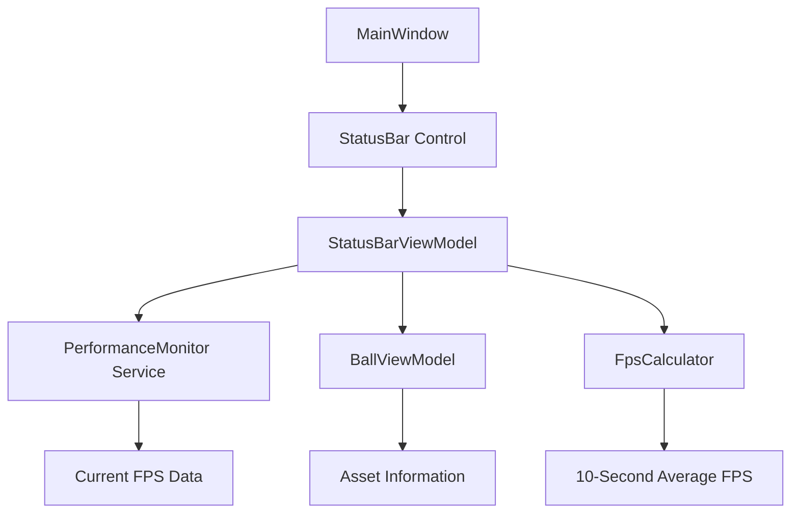

# Design Document

## Overview

The status bar feature will add a horizontal status bar at the bottom of the MainWindow in the BallDragDrop WPF application. The status bar will display real-time performance metrics (current FPS and 10-second average FPS) on the right side, and asset information with a status field on the left side. The implementation will follow the existing MVVM architecture and integrate with the current PerformanceMonitor service.

## Architecture

### High-Level Architecture

The status bar will be implemented using WPF's StatusBar control integrated into the existing DockPanel layout in MainWindow.xaml. The status bar will use data binding to connect with a new StatusBarViewModel that aggregates data from the existing PerformanceMonitor service and asset information from the BallViewModel.



### Integration Points

1. **MainWindow Layout**: The status bar will be added to the existing DockPanel, docked to the bottom
2. **PerformanceMonitor Service**: Will be extended to provide FPS data to the status bar
3. **BallViewModel**: Will expose asset name information for status bar display
4. **MVVM Pattern**: StatusBarViewModel will handle data aggregation and property change notifications

## Components and Interfaces

### StatusBarViewModel

A new ViewModel class that implements INotifyPropertyChanged and manages status bar data:

**Properties:**
- `CurrentFps` (double): Current frames per second
- `AverageFps` (double): Average FPS over the last 10 seconds  
- `AssetName` (string): Name of the currently loaded asset
- `StatusText` (string): Static "Status" text

**Dependencies:**
- `IPerformanceMonitor`: For accessing FPS data
- `BallViewModel`: For accessing asset information
- `ILogService`: For logging

### FpsCalculator

A utility class to calculate the 10-second rolling average FPS:

**Properties:**
- `AverageFps` (double): Current 10-second average

**Methods:**
- `AddFpsReading(double fps)`: Adds a new FPS reading
- `GetAverageFps()`: Returns the current 10-second average

### Enhanced PerformanceMonitor

The existing PerformanceMonitor service will be extended to support status bar integration:

**New Properties:**
- `CurrentFps` (double): Real-time FPS value

**New Events:**
- `FpsUpdated`: Raised when FPS values change

### StatusBar XAML Structure

```xml
<StatusBar DockPanel.Dock="Bottom" Height="25">
    <StatusBarItem>
        <TextBlock Text="{Binding AssetName}" />
    </StatusBarItem>
    <StatusBarItem>
        <TextBlock Text="{Binding StatusText}" />
    </StatusBarItem>
    <StatusBarItem HorizontalAlignment="Right">
        <StackPanel Orientation="Horizontal">
            <TextBlock Text="{Binding CurrentFps, StringFormat='FPS: {0:F1}'}" />
            <TextBlock Text=" | " />
            <TextBlock Text="{Binding AverageFps, StringFormat='Avg: {0:F1}'}" />
        </StackPanel>
    </StatusBarItem>
</StatusBar>
```

## Data Models

### FpsReading

A simple data structure to store FPS readings with timestamps:

```csharp
public struct FpsReading
{
    public double Fps { get; set; }
    public DateTime Timestamp { get; set; }
}
```

### StatusBarData

A data transfer object for status bar information:

```csharp
public class StatusBarData
{
    public double CurrentFps { get; set; }
    public double AverageFps { get; set; }
    public string AssetName { get; set; }
    public string StatusText { get; set; }
}
```

## Error Handling

### FPS Calculation Errors
- **Invalid FPS Values**: Filter out negative or extremely high FPS values (> 1000)
- **Missing Data**: Display "--" when insufficient data is available
- **Timer Failures**: Gracefully handle DispatcherTimer failures with fallback values

### Asset Name Errors
- **Null Asset Names**: Display "No Asset" as default
- **Long Asset Names**: Truncate with ellipsis to prevent layout issues
- **File Path Extraction**: Handle cases where asset path cannot be parsed

### UI Thread Safety
- **Cross-Thread Updates**: Ensure all UI updates occur on the UI thread using Dispatcher
- **Property Change Notifications**: Properly marshal PropertyChanged events to UI thread

## Testing Strategy

### Unit Tests

1. **StatusBarViewModel Tests**
   - Property change notifications
   - FPS value formatting
   - Asset name handling
   - Default value behavior

2. **FpsCalculator Tests**
   - 10-second rolling average calculation
   - Edge cases (empty data, single reading)
   - Time-based data expiration

3. **PerformanceMonitor Extensions Tests**
   - FPS event raising
   - Thread safety
   - Integration with existing metrics

### Integration Tests

1. **MainWindow Integration**
   - Status bar visibility and positioning
   - Data binding functionality
   - Window resize behavior

2. **Performance Impact Tests**
   - Measure overhead of status bar updates
   - Verify no impact on existing ball animation performance
   - Memory usage validation

### UI Tests

1. **Visual Validation**
   - Status bar layout and alignment
   - Text formatting and truncation
   - Real-time update behavior

2. **User Interaction Tests**
   - Status bar behavior during asset loading
   - Performance during intensive operations
   - Window resizing scenarios

## Performance Considerations

### Update Frequency
- FPS updates will be throttled to 10 Hz (every 100ms) to balance responsiveness with performance
- Average FPS calculation will be optimized using a circular buffer approach
- Property change notifications will be batched when possible

### Memory Management
- FPS history will be limited to 100 readings (10 seconds at 10 Hz)
- Weak event subscriptions will be used to prevent memory leaks
- Proper disposal of timers and event handlers

### Threading
- All FPS calculations will occur on background threads
- UI updates will be marshaled to the UI thread using Dispatcher.BeginInvoke
- Thread-safe collections will be used for FPS data storage

## Implementation Phases

### Phase 1: Core Infrastructure
- Create StatusBarViewModel with basic properties
- Implement FpsCalculator utility class
- Add status bar to MainWindow XAML

### Phase 2: Performance Integration
- Extend PerformanceMonitor service
- Implement FPS data collection and averaging
- Connect performance data to status bar

### Phase 3: Asset Integration
- Add asset name property to BallViewModel
- Implement asset name extraction logic
- Connect asset data to status bar

### Phase 4: Polish and Testing
- Add error handling and edge case management
- Implement comprehensive testing
- Performance optimization and validation